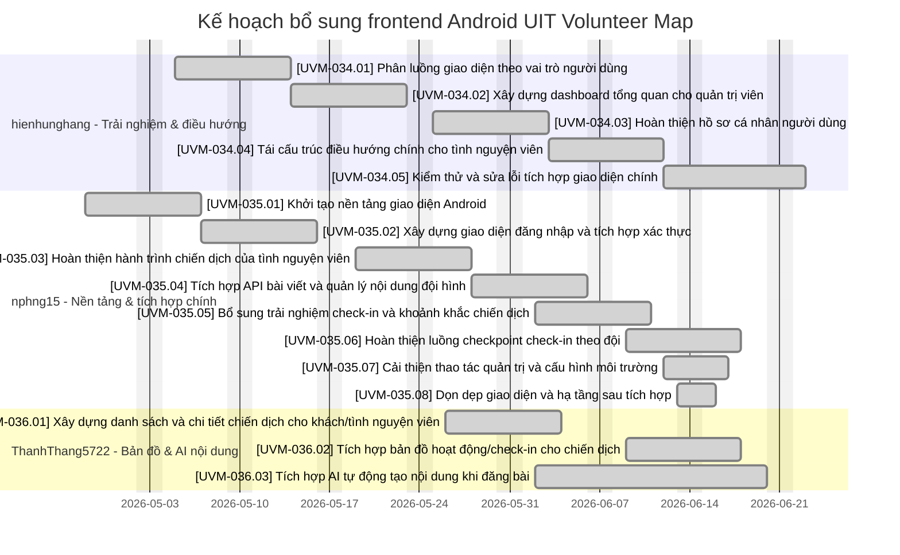

| ID         | Module           | Task Chi Tiết                                                                                              | API Dependency (Endpoint)                                                              | Ngày bắt đầu | Ngày kết thúc |            | Người phụ trách |
| ---------- | ---------------- | ---------------------------------------------------------------------------------------------------------- | -------------------------------------------------------------------------------------- | ------------ | ------------- | ---------- | --------------- |
| UVM-001.01 | cross-module     | Rà soát API contract (Request/Response)                                                                    | ALL Endpoints                                                                          |              |               | Completed  | Phong           |
| UVM-003.01 | app-shell        | Thiết kế package/logical module (Clean Architecture)                                                       |                                                                                        |              | 17/03/2026    | Completed  | Phong           |
| UVM-003.02 | app-shell        | Khai báo Boundary Repository (Auth, Profile, Post...)                                                      |                                                                                        |              | 17/03/2026    |
| UVM-004.01 | core-network     | Cấu hình BuildConfig & Environment URL                                                                     | GET /health                                                                            |              | 17/03/2026    | Completed  | Phong           |
| UVM-005.02 | core-network     | Triển khai Global Error Mapper & Normalize Response Envelope                                               |                                                                                        |              | 17/03/2026    |            |                 |
| UVM-007.01 | app-shell        | Dựng AppNavHost & Định nghĩa Route                                                                         | \-                                                                                     |              | 19/03/2026    | Completed  | Phong           |
| UVM-007.03 | app-shell        | Xây dựng Common UI State (Loading/Error/Empty)                                                             |                                                                                        |              | 19/03/2026    |
| UVM-010.01 | feature-home     | Xây dựng Dashboard                                                                                         | GET /campaigns, GET /teams, GET /posts                                                 |              | 13/04/2025    | Completed  | Thắng           |
| UVM-010.03 | cross-feature    | Xây dựng Volunteer Home Mobile và Campaign Detail Mobile cho luồng guest/volunteer                         | GET /campaigns, GET /campaigns/:id, GET /teams, GET /posts                            |              |               | Completed  | Thắng           |
| UVM-010.01 | feature-auth     | Implement AuthRepository: login, logout, verifyToken (Data Layer)                                          | POST /auth/login, POST /auth/logout, GET /verify                                       |              | 13/04/2025    | Completed  | Phong           |
| UVM-010.02 | feature-auth     | Xây dựng UseCases: LoginUseCase, LogoutUseCase, VerifySessionUseCase (Domain)                              | \-                                                                                     |              | 13/04/2025    |
| UVM-011.01 | feature-auth     | UI Login Screen: Layout, Inputs (Username, Password), Toggle Password Visibility                           | \-                                                                                     |              | 13/04/2025    | Completed  | Phong           |
| UVM-011.02 | feature-auth     | Logic Validation (Required fields, Disable submit) & Loading State                                         | \-                                                                                     |              | 13/04/2025    |
| UVM-011.03 | feature-auth     | Xử lý & Hiển thị lỗi API (401, 400, Server Error) trên UI Login                                            | \-                                                                                     |              | 13/04/2025    |
| UVM-012.01 | feature-auth     | Login Success Flow: Lưu Token/User/Role vào DataStore & Phát sự kiện thành công                            | \-                                                                                     |              | 13/04/2025    | Completed  | Phong           |
| UVM-012.02 | feature-auth     | Logic Điều hướng (Routing) đến Home dựa trên Role sau Login thành công                                     | \-                                                                                     |              | 13/04/2025    |
| UVM-013.01 | feature-auth     | UI Confirm Logout Dialog & Logic Reset Navigation Graph                                                    | \-                                                                                     |              | 13/04/2025    | Completed  | Phong           |
| UVM-013.02 | feature-auth     | Logout logic: Clear Session (DataStore) & Call API Logout (Đảm bảo clear local khi API lỗi)                | POST /auth/logout                                                                      |              | 13/04/2025    |
| UVM-014.01 | feature-profile  | Implement UserRepository: getProfile, updateProfile (Data Layer)                                           | GET /users/profile, PUT /users/profile                                                 |              | 13/04/2025    | Completed  | Hiền            |
| UVM-014.02 | feature-profile  | Tạo Profile DTO & Mapper (Xử lý PascalCase keys: FullName, Email, PhoneNumber...)                          | GET /users/profile                                                                     |              | 13/04/2025    |
| UVM-015.01 | feature-profile  | UI Profile Screen: Hiển thị thông tin User                                                                 | GET /users/profile                                                                     |              | 13/04/2025    | Completed  | Hiền            |
| UVM-016.01 | feature-profile  | UI Edit Profile Form (FullName, Mssv, Class, Email, PhoneNumber) & Local Validation                        |                                                                                        |              | 13/04/2025    | Completed  | Hiền            |
| UVM-016.02 | feature-profile  | Logic Edit Profile: Compare Dirty State, Confirm Save & Handle Email Conflict                              | PUT /users/profile                                                                     |              | 13/04/2025    |
| UVM-016.03 | feature-profile  | Cấu hình Read-only fields theo Role & Tích hợp nút Logout trong Settings/Profile                           |                                                                                        |              | 13/04/2025    |
| UVM-016.04 | feature-profile  | Hoàn thiện luồng Edit Profile theo role: dirty state, confirm save, email conflict và logout flow          | PUT /users/profile                                                                     |              |               | Completed  | Hiền            |
| UVM-017.01 | feature-campaign | Triển khai CampaignRepository: get/create/update/delete (Data Layer)                                       | GET /campaigns, POST /campaigns, PUT /campaigns/:id, DELETE /campaigns/:id             |              | 13/04/2025    | Completed  | Thắng           |
| UVM-017.02 | feature-campaign | Xây dựng UseCases: GetCampaigns, ManageCampaign và Validate logic (Domain)                                 | \-                                                                                     |              | 13/04/2025    |
| UVM-018.01 | feature-campaign | UI Campaign List: Hiển thị danh sách, xử lý Empty state và Pull-to-refresh                                 | GET /campaigns                                                                         |              | 13/04/2025    | Completed  | Thắng           |
| UVM-018.02 | feature-campaign | UI Campaign Detail: Thông tin chi tiết và danh sách Team                                                   | GET /campaigns/:id, GET /teams                                                         |              | 13/04/2025    |
| UVM-018.03 | feature-campaign | Xây dựng Team Formation Detail và Add Post popup trong luồng Campaign Detail                               | \-                                                                                     |              |               | Completed  | Thắng           |
| UVM-019.01 | feature-campaign | UI Create/Edit Campaign Form: Layout, Inputs, Date Picker và Validation                                    | \-                                                                                     |              | 13/04/2025    | Completed  | Thắng           |
| UVM-019.02 | feature-campaign | Logic CRUD: Preload dữ liệu, Dirty form tracking và Handle Conflict                                        | POST /campaigns, PUT /campaigns/:id                                                    |              | 13/04/2025    |
| UVM-019.03 | feature-campaign | UI Confirm Delete Dialog và Logic xử lý sau khi xóa (Optimistic UI)                                        | DELETE /campaigns/:id                                                                  |              | 13/04/2025    |
| UVM-019.04 | feature-campaign | Hoàn thiện Campaign Form end-to-end: UI, preload dữ liệu, dirty tracking và conflict handling              | POST /campaigns, PUT /campaigns/:id                                                    |              |               | Completed  | Thắng           |
| UVM-020.01 | feature-campaign | Phân quyền Guest: Ẩn/Hiện UI                                                                               | \-                                                                                     |              | 13/04/2025    | Completed  | Thắng           |
| UVM-021.01 | feature-team     | Triển khai TeamRepository (Data Layer): get/create/update/delete teams & attachments                       | GET /teams, POST /teams, PUT /teams/:id, DELETE /teams/:id, GET /teams/:id/attachments |              | 13/04/2025    | In progess | Hiền            |
| UVM-021.02 | feature-team     | Xây dựng UseCases: GetTeams, ManageTeam và logic phân quyền (Domain)                                       | \-                                                                                     |              | 13/04/2025    |
| UVM-022.01 | feature-team     | UI Team List Public: Hiển thị danh sách card team (image, name, leaders)                                   | GET /teams                                                                             |              | 13/04/2025    | In progess | Hiền            |
| UVM-022.02 | feature-team     | UI Team Detail Public: Hiển thị thông tin, leader và gallery attachments                                   | GET /teams/:id, GET /teams/:id/attachments                                             |              | 13/04/2025    |
| UVM-023.01 | feature-team     | UI Team Edit: Leader chỉnh sửa team của mình                                                               | PUT /teams/:id                                                                         |              | 13/04/2025    | In progess | Hiền            |
| UVM-023.02 | feature-team     | UI Add Team Attachments Form                                                                               | POST /teams/:id/attachments                                                            |              | 13/04/2025    |
| UVM-025.01 | feature-post     | Triển khai PostRepository (Data Layer): get/create/update/delete posts & photos                            | GET /posts, POST /posts, PUT /posts/:id, DELETE /posts/:id, POST /posts/:id/photos     |              |               |            | Phong           |
| UVM-025.02 | feature-post     | Xây dựng UseCases và chuẩn hóa PostUiModel: map thumbnail, xử lý isFirstImage (Domain)                     | \-                                                                                     |              |               |
| UVM-026.01 | feature-post     | UI Post List Public: Hiển thị danh sách card bài viết, thumbnail fallback, author/team subtitle            | GET /posts                                                                             |              |               |            | Phong           |
| UVM-026.02 | feature-post     | UI Post Detail Public: Hiển thị nội dung bài viết                                                          | GET /posts/:id                                                                         |              |               |
| UVM-027.01 | feature-post     | UI Create Post Form: Nhập title/content, chọn team, upload nhiều ảnh và chọn ảnh bìa (isFirstImage)        | POST /posts                                                                            |              |               |            | Phong           |
| UVM-027.02 | feature-post     | Logic Photo Management: Thêm ảnh mới và đồng bộ trạng thái isFirstImage                                    | POST /posts/:id/photos                                                                 |              |               |
| UVM-027.03 | feature-post     | UI Edit & Delete Post: Prefill dữ liệu, cập nhật từng phần (partial update) và xử lý xóa mềm (soft delete) | PUT /posts/:id, DELETE /posts/:id                                                      |              |               |
| UVM-029.01 | feature-admin    | Triển khai AccountRepository (Data Layer): get/create/update/delete accounts                               | GET /accounts, POST /accounts, PUT /accounts/:id, DELETE /accounts/:id                 |              |               |            |                 |
| UVM-029.02 | feature-admin    | UI Admin Dashboard: Shortcut cards cho Campaigns, Teams, Posts, Accounts                                   | \-                                                                                     |              |               |
| UVM-030.01 | feature-admin    | UI Account List: Hiển thị danh sách, tìm kiếm và lọc theo Role/Username                                    | GET /accounts                                                                          |              |               |            |                 |
| UVM-031.01 | feature-admin    | UI Create Leader Account Form: Layout, Inputs và Validation (Email, MSSV, Password, Fullname)              | POST /accounts                                                                         |              |               |            |                 |
| UVM-031.02 | feature-admin    | UI Edit Account: Cập nhật Password, Role và gán TeamId từ dropdown                                         | PUT /accounts/:id                                                                      |              |               |
| UVM-031.03 | feature-admin    | UI Confirm Delete Account Dialog và logic làm mới danh sách sau khi xóa                                    | DELETE /accounts/:id                                                                   |              |               |
| UVM-032.01 | feature-admin    | UI Create Team (Admin-only): Tên, chọn Campaign, chọn Leader, Image & Attachments                          | POST /teams                                                                            |              |               |            |                 |
| UVM-033.01 | cross-feature    | Bootstrap Android app shell, auth baseline, `AppNavHost`, test harness và smoke test đầu tiên cho volunteer flow | POST /auth/login, GET /campaigns/:id, GET /posts, GET /teams/:id                      | 19/04/2026   | 20/04/2026    | Completed  | Codex           |
| UVM-033.02 | cross-feature    | Xây dựng feature Home cho guest/volunteer, repository/use case/home state và hoàn thiện handoff `Login -> VolunteerHome` | POST /auth/login, GET /campaigns                                                       | 19/04/2026   | 20/04/2026    | Completed  | Codex           |
| UVM-033.03 | cross-feature    | Triển khai đầy đủ feature campaign/team/post mock end-to-end: detail, list, form, team detail, campaign posts, add post và wiring điều hướng | GET /campaigns, GET /campaigns/:id, GET /posts, GET /teams, GET /teams/:id            | 19/04/2026   | 20/04/2026    | Completed  | Codex           |
| UVM-033.04 | cross-feature    | Bổ sung unit test ViewModel, test utilities và regression coverage cho volunteer journey cùng các route mở rộng | POST /auth/login, GET /campaigns/:id, GET /posts, GET /teams/:id                      | 19/04/2026   | 20/04/2026    | Completed  | Codex           |
| UVM-033.05 | cross-feature    | Refresh UI volunteer mobile flow: redesign login/home/campaign/team/post, Việt hóa copy, harden navigation, cập nhật mock data và ảnh chiến dịch thật | POST /auth/login, GET /campaigns, GET /campaigns/:id, GET /posts, GET /teams/:id      | 20/04/2026   | 21/04/2026    | Completed  | Codex           |
| UVM-034.01 | core-network     | Triển khai Retrofit/OkHttp remote API foundation, BuildConfig BASE_URL debug/release, cleartext config và response envelope | ALL Endpoints                                                                          | 25/05/2026   | 25/05/2026    | Completed  | nphng15         |
| UVM-034.02 | feature-auth     | Nối Auth API thật: login username/password, map token/account/role, mở rộng session runtime và cập nhật test auth | POST /auth/login, POST /auth/logout, GET /verify                                      | 25/05/2026   | 25/05/2026    | Completed  | ThanhThang5722  |
| UVM-034.03 | feature-campaign | Nối Campaign CRUD API thật qua RemoteCampaignRepository, DTO/request mapper và unit test repository contract | GET /campaigns, GET /campaigns/:id, POST /campaigns, PUT /campaigns/:id, DELETE /campaigns/:id | 25/05/2026   | 25/05/2026    | Completed  | hienhunghang    |
| UVM-034.04 | feature-team     | Nối Team API thật cho campaign detail/team detail: public teams, team detail và attachments với fallback UI mapping | GET /teams, GET /teams/:id, GET /teams/:id/attachments                                | 25/05/2026   | 25/05/2026    | Completed  | nphng15         |
| UVM-034.05 | feature-post     | Nối Post CRUD API thật: list/detail/create/update/delete/photo, map postId/photoId và cờ isDeleted/isFirstImage | GET /posts, GET /posts/:id, POST /posts, PUT /posts/:id, DELETE /posts/:id, POST /posts/:id/photos | 25/05/2026   | 25/05/2026    | Completed  | ThanhThang5722  |

### 2.3. Timeline bổ sung theo phân công commit frontend

